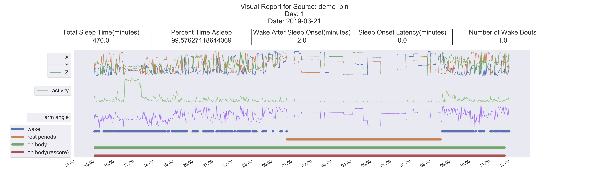

# SleepPy
Python package for sleep analysis of raw accelerometer data from GeneActiv wrist watches

## Overview
SleepPy is a set of methods and classes built to process raw accelerometer data captured on the wrist. The current implementation expects data from GeneActiv wrist watches, using a loader to construct a dataframe from the data. Further iterations will specify a more general input format for broader use. The package analyzes sleep on a 24-hour basis and generates human readable reports that include clinical endpoints for sleep. Please refer to the references section for a list of all published works used to inform the creation of the package.

## Requirements
In order to use SleepPy please install the listed requirements as follows (note: python version 2.7)

```sh
pip install -r requirements.txt
```

SleepPy can be installed through pip:

```sh
pip install sleeppy
```

It can also be installed from source:

```sh
git clone https://github.com/yiorg/SleepPy
cd sleeppy
python setup.py install
```

If given a permissions error, you may have to run the following and input your password:

```sh
sudo python setup.py install
```


## What does SleepPy do?
There are seven major steps that SleepPy goes through when processing data:

1. Splitting by day: Loads the input file and splits the resulting data into 24-hour segments, defined from noon to noon.

2. Activity index: Calculates the activity index feature for 1 minute epochs for each of the days.

3. On-body detection: Runs on-body/off-body detection for each of the days for debugging purposes

4. Major rest period: Calculates the major rest period (sleep window) for each day.

5. Sleep/wake: Runs sleep/wake predictions on each minute in the major rest period for each day.

6. Calculate endpoints: Using the above data, clinical endpoints for sleep are calculated for the major rest period of each day.

7. Visualize results: Creates a set of visual reports summarizing all findings for each day.

## How to run SleepPy
SleepPy is designed for ease of use in a research environment, and therefore attempts to remove as much of the burden as possible from the user. The following syntax will run SleepPy in full and generate all necessary data and reports, saving all intermediate data in various folders. SleepPy can be run with both GeneActiv .bin files, as well as the raw .csv outputs of the GeneActiv software. Processing the .bin files adds a non trivial amount of processing time to the running of SleepPy, and for quick results we recommend using the .csv version where possible.

```sh
from sleeppy.sleep import *

SleepPy(input_file='/Users/user/input_files/data.csv',
        results_directory='/Users/user/Results/',
        sampling_frequency=100)
```

SleepPy can also be run with the following arguments. Start and stop buffer allow for the specification of ignored time at the beginning and end of the GeneActiv file. If a research site knows, for instance, that the watch will not be on the subject for one hour at the beginning and end of the recorded session, that data can be excluded. The same can also be done with the start and stop time arguments, which allow for the specification of a date and time for starting and stopping the analysis. The formats for these arguments can be found in the sleep.py docs.

```sh
from sleeppy.sleep import *

SleepPy(input_file='/Users/user/input_files/data.csv',
        results_directory='/Users/user/Results/',
        sampling_frequency=100,
        start_buffer='0s',
        stop_buffer='0s',
        start_time='',
        stop_time='')
```

## Running the demo files
#### From the terminal window you can run the demo directly:

```sh
cd sleeppy/sleeppy/demo
python demo.py
```

#### You can also run the demo through the python interpreter:

Assuming you've installed the package, in the terminal window start python simply by typing 

```sh
python
```

In the interpreter window you can then import and run the demo with the following two commands:

```sh
>>> import sleeppy.demo as demo
>>> demo.run_demo()
```

The demo script will prompt you to type in a results directory, if simply testing you can type something like /Users/username/Desktop to have the results saved to your desktop.

Any of the above should take approximately 10-15 minutes, though depending on your machine this may vary. It should generate and save all intermediate data, as well as all the relevant reports. Due to file size constraints, the demo file type is .bin which adds a nontrivial amount to the processing time.

## Interpreting the results
The most informative reports are the reports provided for each individual day, which resemble the image below (demo report):



As shown above, the report includes the source file name, the number of the day in the series of days provided, the start date of the data being shown, and a table of all calculated endpoints. Below the table is a graph of the data available during the 24-hour window specified. The subplots are set up to show the multiple forms that the data can take during the analysis. They are layed out as follows:

1. XYZ: The first level is simply the raw tri-axial accelerometer signal in X, Y, and Z.

2. Activity index: The second level is a plot of the minute by minute activity index values, which reflect the intensity of activity for each minute.

3. Arm-angle: The third level is a plot of the change in arm-angle over 24 hours, this is the feature used to determine the major rest period.

4. Wake: The fourth level represents sleep/wake predictions run on the entirety of the data, though only those predictions that fall under the major rest period are considered when computing clinical endpoints.

5. Rest periods: The fifth level is all periods of major rest detected by the major rest period algorithm. Only the largest, or major, rest period is used for calculating all clinical endpoints.

6. On-body: The sixth level is the raw predictions for on-body detection, without any filtering or rescoring.

7. On-body (rescored): The seventh level is the rescored predictions for on body detection.

#### Note: There is no logic tying either on-body detection to the calculation of sleep endpoints. The on-body detection is currently used *only* as a visual aid to determine possible sources of error in major rest period calculation.

#### As a result of the above, reliable results can be produced in only those cases where there is close to 100% wear compliance during a given 24-hour period, even as little as 1 hour of non wear can have a serious detrimental impact on the proper detection of the major rest period, and all subsequent clinical endpoints.

#### Suggested use of the current package is to evaluate the results of each day visually, to ensure that the proper/expected behavior is in fact what is being produced.

## References
#### The major rest period detection and wear detection functions of this package are based off of the following papers, as well as their implementation in the R package GGIR:

van Hees V, Fang Z, Zhao J, Heywood J, Mirkes E, Sabia S, Migueles J (2019). GGIR: Raw Accelerometer Data Analysis.
doi: 10.5281/zenodo.1051064, R package version 1.9-1, https://CRAN.R-project.org/package=GGIR.

van Hees V, Fang Z, Langford J, Assah F, Mohammad Mirkes A, da Silva I, Trenell M, White T, Wareham N, Brage S (2014).
'Autocalibration of accelerometer data or free-living physical activity assessment using local gravity and
temperature: an evaluation on four continents.' Journal of Applied Physiology, 117(7), 738-744.
doi: 10.1152/japplphysiol.00421.2014, https://www.physiology.org/doi/10.1152/japplphysiol.00421.2014

van Hees V, Sabia S, Anderson K, Denton S, Oliver J, Catt M, Abell J, Kivimaki M, Trenell M, Singh-Maoux A (2015).
'A Novel, Open Access Method to Assess Sleep Duration Using a Wrist-Worn Accelerometer.' PloS One, 10(11).
doi: 10.1371/journal.pone.0142533, http://journals.plos.org/plosone/article?id=10.1371/journal.pone.0142533.

#### The detection of sleep and wake states uses a heuristic model based on the algorithm described in:

Cole, R.J., Kripke, D.F., Gruen, W.'., Mullaney, D.J., & Gillin, J.C. (1992). Automatic sleep/wake identification
from wrist activity. Sleep, 15 5, 461-9.

#### The activity index feature is based on the index described in:

Bai J, Di C, Xiao L, Evenson KR, LaCroix AZ, Crainiceanu CM, et al. (2016) An Activity Index for Raw Accelerometry
Data and Its Comparison with Other Activity Metrics. PLoS ONE 11(8): e0160644.
https://doi.org/10.1371/journal.pone.0160644

## Author
Yiorgos Christakis

## License
This project is licensed under the MIT License - see the [LICENSE.md](LICENSE.md) file for details


